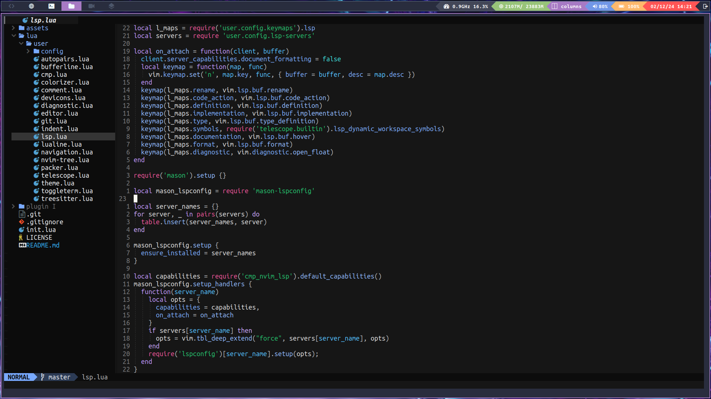

# My-neovim

This is my personal configuration of neovim with lua.

```sh
# Before setting up the config, install Packer (example below with AUR)
yay -S nvim-packer-git
```

> **Note**: this neovim config is not stable, and does not have maintance.

## Captures



## License

My-neovim Copyright (c) 2023 Guillex387. All rights reserved.

Licensed under the [MIT](LICENSE) license.
